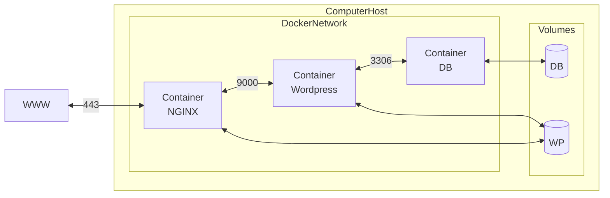

```mermaid
graph LR
    WEB[WWW] <--> |443|NX

    subgraph ComputerHost
        DockerNetwork
        Volumes
    end

    subgraph DockerNetwork
    DB
    WP
    NX
    end

    subgraph Volumes
    WPvol
    DBvol
    end 

    NX["`Container
    NGINX`"]
    WP["`Container
    Wordpress`"]
    DB["`Container
    DB`"]
    
    WPvol[(WP)]
    DBvol[(DB)]

    NX <--> |9000| WP
    WP <--> |3306| DB
    
    DB <--> DBvol
    WP <--> WPvol
    NX <--> WPvol
```
