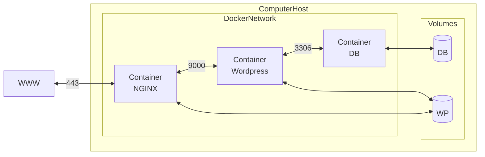

# Inception

Installation of an LEMP architecture decoupled with docker containers and running on a virtual machine.

# Services
- An https server : NGINX with TLSv1.2 or TLSv1.3 only.
- A content management system : WordPress + php-fpm (installed and configured).
- A database : MariaDB

# Infrastructure 

# Useful links
Notes, documentation plus some extra links on the project are on my notion : 
[Notion](https://river-weight-158.notion.site/Inception-8b6b536241144669907e9a8b2b7c9723)

